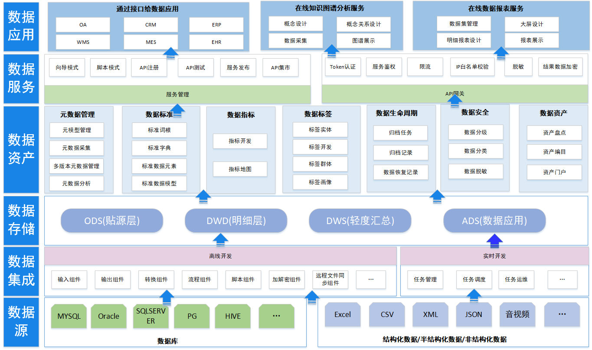
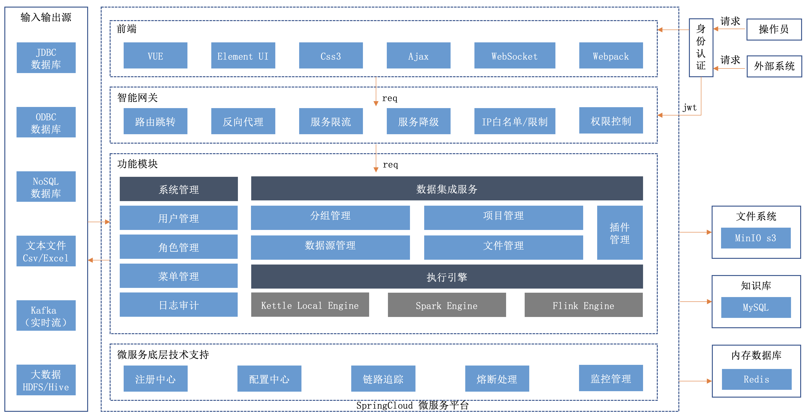
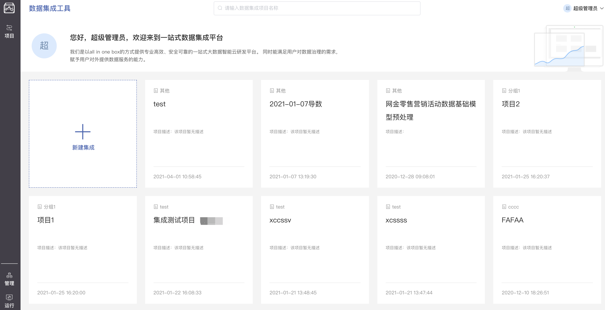
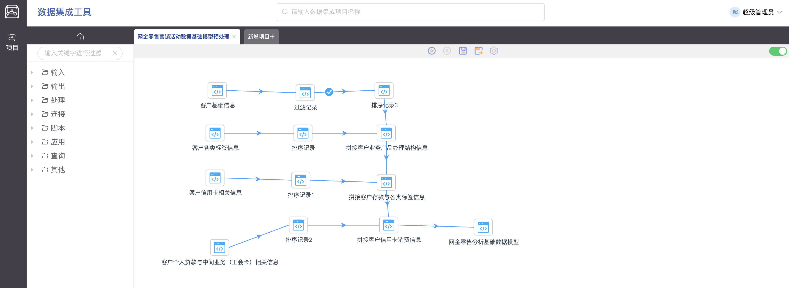
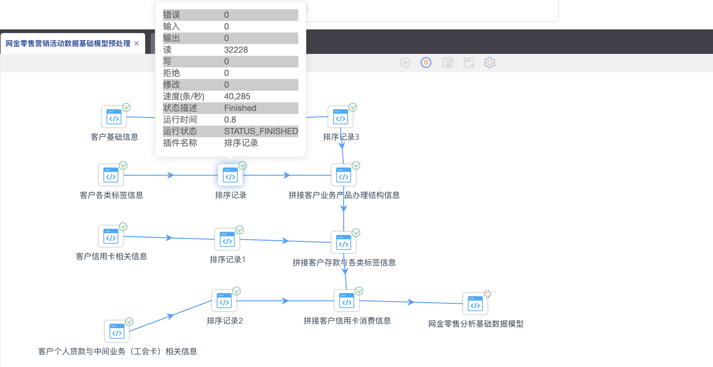
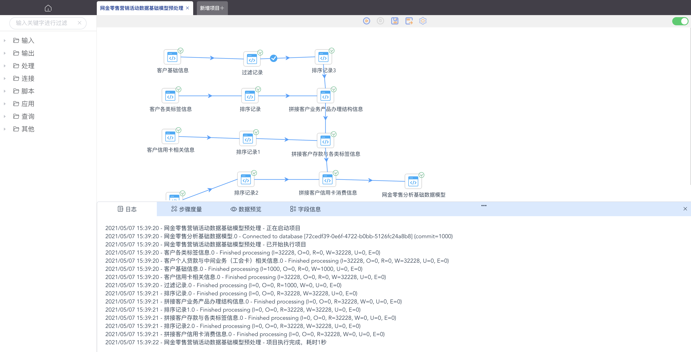

<p align="center">
  <strong>基于kettle的可视化数据集成平台</strong><BR/>
 
</p>

<p align="center">
    <a target="_blank" href="https://github.com/young-datafan/data-integration/blob/develop/LICENSE">
        
    </a>
    <a target="_blank" href="https://www.oracle.com/technetwork/java/javase/downloads/index.html">
        
    </a>
</p>
<br/>

--------------------------------------------------------------------------------
# AD部分
  公司有整套商业版数据中台源码出售，基于doris实现的数据仓库，支持PB级别的数据存储分析，功能模块如下：    
## 功能模块
###  1、数据源管理    
支持各类关系型数据库、非关系型数据库、MQ、文件源等。
###  2、元数据管理
元模型、最新元数据、定版元数据、数据全景图、数据血缘、数据影响分析、多版本元数据对比
###  3、数据标准管理
标准词根、标准字典、数据元、标准模型、发布、多版本维护、数据标准核对    
###  4、数据仓库管理
支持主题域、主题、数仓集群、维度建模、模型运维、模型审计、模型数据查、物化视图
###  5、数据质量
规则定义，任务执行，结果查看，统计分析，质量问题修复日志    
###  6、数据指标
数据指标在线开发，数据指标地图、数据指标看板
###  7、数据标签
标签对象、标签管理、置标任务、标签圈群、标签画像
###  8、数据安全
分级分类、数据脱敏、分级分类授权
###  9、数据生命周期
数据归档，数据恢复
###  10、数据服务
接口在线开发(支持通过JS脚本对数据进行处理后返回，支持动态SQL)，API注册(手写代码开发的接口注册到数据服务中)，接口测试，接口发布，应用管理，应用授权    
##  11、数据资产
数据资产标签、数据资产目录、数据资产门户、数据资产申请使用、AI问数
###  10、数据集成/开发
实时开发(支持CDC)、离线开发(支持数据库、csv、excel、接口、ftp、kafka、mqtt、mongodb等数据源接入)，在线拖拉拽生成数据集成任务
###  11、数据可视化
数据集，报表管理，报表设计，报表查看、知识图谱构建、知识图谱查看
###  12、数据运维
微服务监控、中间件监控、服务器监控、数据仓库定时备份恢复、数据服务接口监控。
###  13、系统日志
syslog查询、syslog实时查看、登录日志、审计日志
###  14、主数据
主数据模型管理、自动生成代码码段管理、主数据管理、主数据分发
## 技术栈
后端：Java springboot2.7 springcloud/alibaba  mybatis plus hutool 等常见技术    
前端：vue  elementui  vite 等常见技术    
中间件：doris，mysql，redis，rabbitmq，minio，zookeeper。        
### 有演示环境和方案PPT，需要加V:abcd19920605
## 架构

# 本项目介绍正文开始
注意，只有商业版才有完整的中台功能
# 架构



--------------------------------------------------------------------------------

# 模块

* dataintegration-common : 公共模块
* dataintegration-group : 分组管理
* dataintegration-gateway : 服务网关
* dataintegration-project : 脚本管理
* dataintegration-run : 数据集成运行模块
* dataintegration-sso : sso单点登录模块
* dataintegration-sys : 系统管理模块
* dataintegration-model : 模型管理
* dataintegration-file-management : 文件管理
* dataintegration-ui : 前端vue模块

--------------------------------------------------------------------------------

# 功能特点

基于kettle实现的web版数据集成平台，致力于提供web可拖拽的数据集成平台。

其主要特点有：
* vue2+springCloud架构（后续支持vue3）
* 支持kettle本地引擎，后续扩展spark引擎
* 支持ftp/s3协议的文件读取

由于公司采用springcloud微服务架构开发整个数据中台产品，数据集成属于其中的一个子模块，所以暂时还是采用springcloud的架构进行开源，便于版本统一。

--------------------------------------------------------------------------------

# 用户界面截图






--------------------------------------------------------------------------------

# 近期研发计划

新版也在同步研发中，后续会开放

--------------------------------------------------------------------------------

# 参与贡献

非常欢迎大家来参与贡献，贡献流程请参考：
TODO


--------------------------------------------------------------------------------

# 如何构建
## 打包项目
```bash
mvn -B clean compile install -Prelease -Dmaven.test.skip=true -Dcheckstyle.skip=true
```
## 启动前置环境
* <a  href ="https://www.oracle.com/technetwork/java/javase/downloads/jdk8-downloads-2133151.html">Jdk1.8</a>
* <a  href ="https://www.mysql.com/">Mysql 5.7.+</a>
* <a  href ="https://docs.consulproject.org/docs/english-documentation/introduction/local_installation">consul</a>
* <a  href ="https://redis.io/">Redis</a>

### 创建数据库
> 使用数据库连接工具连接数据库，创建数据库dataintegration，将项目/install/sql/dataintegration.sql导入数据库中，初始化数据库文件。
### 服务启动
#### 修改配置
* dataintegration-gateway : 服务网关
* dataintegration-group : 分组管理
* dataintegration-project : 脚本管理
* dataintegration-run : 数据集成运行模块
* dataintegration-sso : sso单点登录模块
* dataintegration-sys : 系统管理模块
* dataintegration-model : 模型管理
* dataintegration-file-management : 文件管理

``` bash
 依次修改 application-local.yaml
 spring.cloud.consul.host: 127.0.0.1 ,ip改为启动的consul IP
 spring.cloud.consul.port: 8500 ,ip改为启动的consul 端口
 spring.datasource.url: jdbc:mysql://192.168.10.211:13306/ 修改启动的mysql url
 spring.datasource.username:  修改启动的mysql的账号
 spring.datasource.password:  修改启动的mysql的密码
 使用idea或者其他工具运行服务 dataintegration-**-provider
```

#### 启动前端ui
> 终端进入 dataintegration-ui 目录

``` bash
# install dependencies
npm install

# serve with hot reload at localhost:8080
npm run dev

```
> 访问前端页面：http://127.0.0.1:8081/dataintegration-ui/#/  默认的用户是admin，默认的密码是123456

###


--------------------------------------------------------------------------------


## 版权

请参考 [LICENSE](https://gitee.com/fhs-opensource/data-center/blob/master/LICENSE) 文件.

--------------------------------------------------------------------------------

## 原项目链接

https://github.com/young-datafan-ooooo1/data-integration
